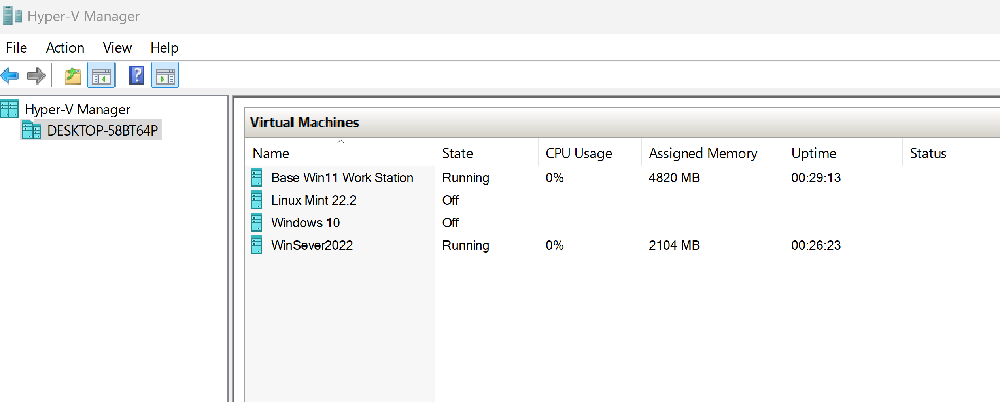
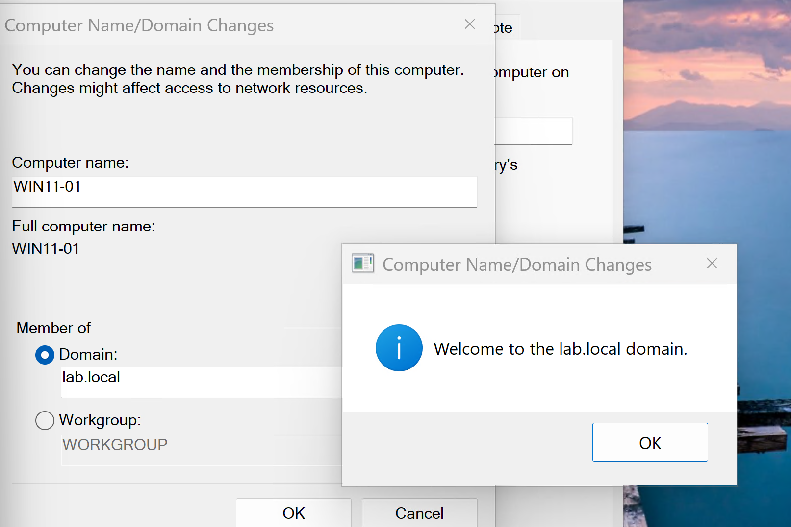
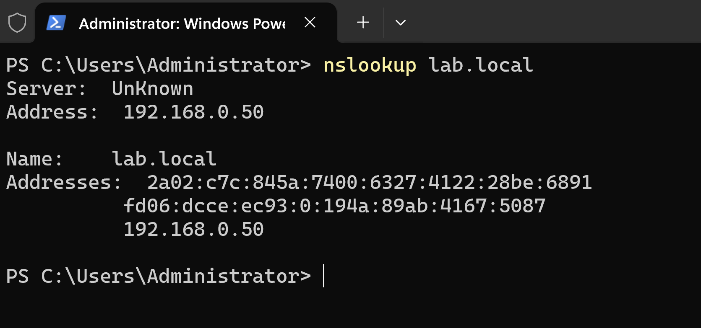
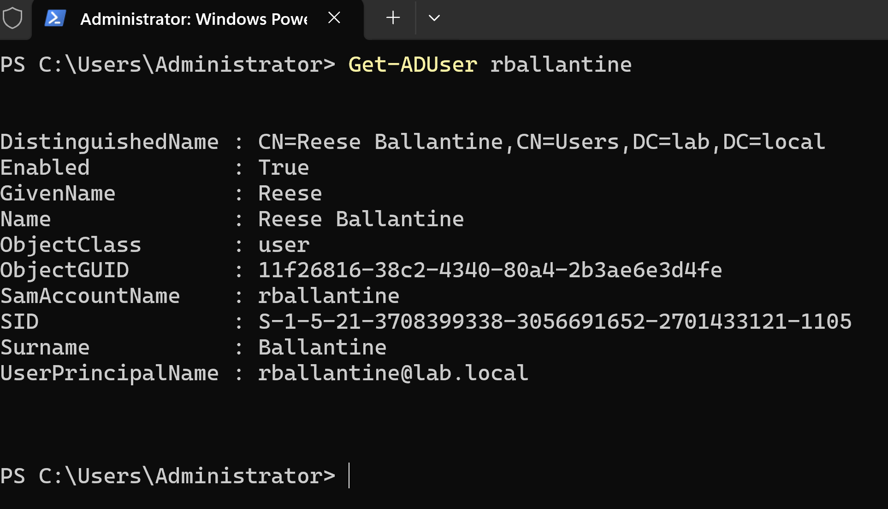
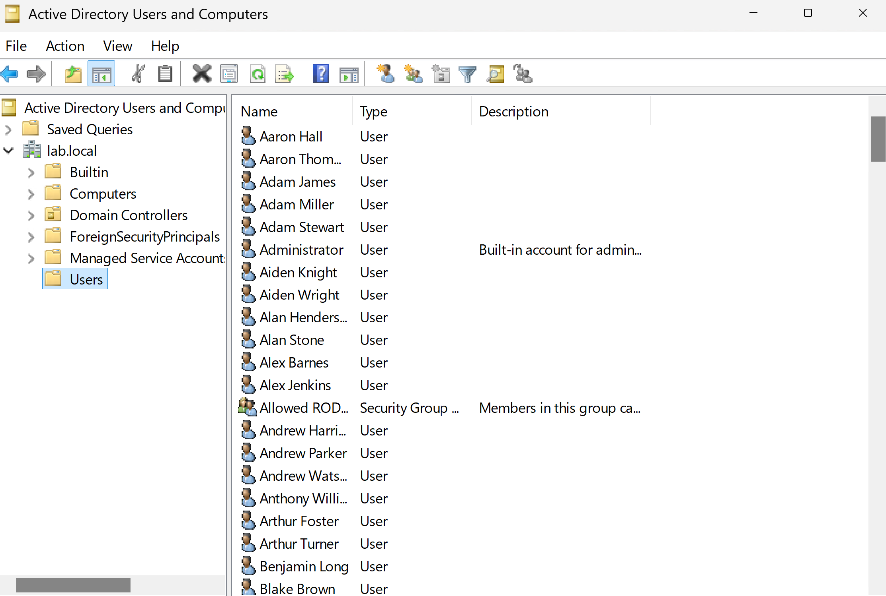
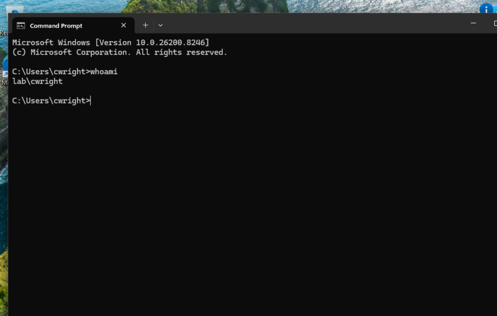

# Active Directory Homelab

## Overview

This project demonstrates the deployment of a Windows Server 2022 Active Directory environment in a Hyper-V virtual lab. The environment includes a Windows Server 2022 Server Core domain controller, DNS services, a Windows 11 domain-joined workstation, and PowerShell automation for provisioning Active Directory users.

The objective of this lab was to gain hands-on experience with enterprise Windows infrastructure, Active Directory administration, PowerShell scripting, and troubleshooting common domain and networking issues.

---

## Features

- Windows Server 2022 Server Core Domain Controller
- Active Directory Domain Services (AD DS)
- DNS configuration and management
- Windows 11 domain-joined workstation
- Hyper-V virtualized lab environment
- PowerShell-based Active Directory user provisioning
- Remote administration using RSAT
- JSON-driven user creation

---

## Technologies Used

- Windows Server 2022 (Server Core)
- Windows 11
- Hyper-V
- Active Directory Domain Services (AD DS)
- DNS
- PowerShell
- PowerShell Remoting
- RSAT
- JSON

---

## Project Structure

```text
active-directory-homelab/
├── 01_install_dc/
├── code/
│   ├── gen_ad.ps1
│   ├── random_domain.ps1
│   ├── .gitignore
│   └── data/
├── screenshots/
└── README.md
```

---

## Lab Objectives

- Deploy a Windows Server 2022 Server Core Domain Controller
- Install and configure Active Directory Domain Services (AD DS)
- Configure DNS for domain services
- Join a Windows 11 workstation to the domain
- Automate Active Directory user creation with PowerShell
- Manage Active Directory remotely using RSAT
- Practice troubleshooting DNS and domain connectivity

---

## Lab Screenshots

### Hyper-V Environment



### Windows Server 2022 Server Core


### Windows 11 Joined to the Domain



### DNS Resolution



### Automated Active Directory User Provisioning



### Active Directory Users and Computers



### Domain User Verification



---

## PowerShell Automation

The lab includes PowerShell scripts that automate Active Directory user provisioning from a JSON schema. The provisioning script includes basic error handling to report failed account creation and improve reliability during bulk user creation.

Example:

```powershell
.\gen_ad.ps1 .\ad_schema.json
```

---

## Skills Demonstrated

- Active Directory Administration
- Windows Server Administration
- Server Core Management
- DNS Configuration
- Domain Joining
- Hyper-V Administration
- PowerShell Scripting
- PowerShell Remoting
- RSAT Administration
- Active Directory User Provisioning
- Windows Networking
- Troubleshooting

---

## Key Outcomes

- Successfully deployed a Windows Server 2022 Server Core Domain Controller.
- Configured Active Directory Domain Services and DNS.
- Joined a Windows 11 workstation to the Active Directory domain.
- Automated Active Directory user provisioning with PowerShell.
- Verified authentication using a standard domain user account.
- Managed Active Directory remotely using RSAT.
- Diagnosed and resolved DNS and domain connectivity issues.

---

## What I Learned

Through building this homelab I gained practical experience with:

- Deploying and configuring a Windows Server 2022 Server Core Domain Controller
- Configuring Active Directory Domain Services (AD DS) and DNS
- Joining Windows clients to an Active Directory domain
- Managing Active Directory remotely using RSAT
- Automating user provisioning with PowerShell
- Troubleshooting DNS configuration, domain joins, and authentication issues
- Using Git and GitHub to document and publish technical projects

---

## Acknowledgements

This homelab was built for hands-on learning and practical experience with Windows Server, Active Directory, PowerShell automation, and enterprise system administration.

The user provisioning automation was inspired by John Hammond's Active Directory homelab tutorials and adapted for this project.